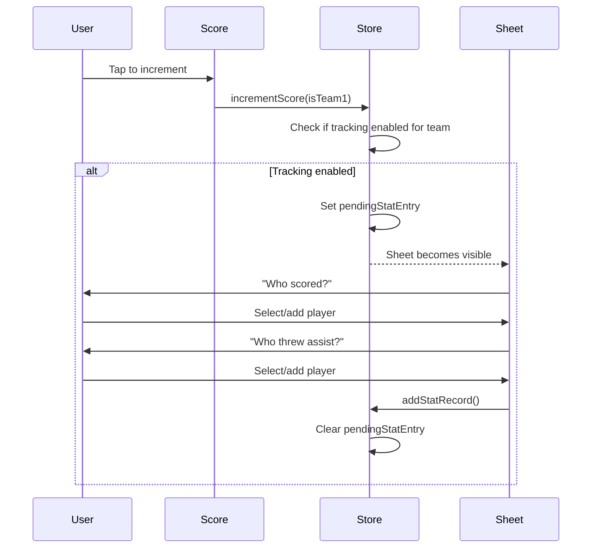

# Stat Tracking System

> Design documentation for the goal/assist tracking feature.

## Overview

The stat tracking system allows recording who scored goals and threw assists during gameplay. It's designed to be unobtrusive and built progressively—no upfront roster setup required.

## Data Model

```typescript
// In store/gameStore.ts

interface StatRecord {
  pointNumber: number; // Sequential point # for this team
  team: 'team1' | 'team2';
  goal: string | null; // Player name or null (unknown)
  assist: string | null;
}

interface TurnoverRecord {
  team: 'team1' | 'team2'; // Team responsible for the action
  type: 'block' | 'throwaway' | 'drop';
  player: string | null;
}
```

## State

| Property               | Type                            | Description                                    |
| ---------------------- | ------------------------------- | ---------------------------------------------- |
| `statTrackingEnabled`  | `boolean`                       | Whether stat tracking is enabled (for my team) |
| `team1Roster`          | `string[]`                      | Built progressively as players are added       |
| `team2Roster`          | `string[]`                      | Built progressively as players are added       |
| `statRecords`          | `StatRecord[]`                  | All recorded stats for the game                |
| `pendingStatEntry`     | `{ team, pointNumber } \| null` | Triggers stat entry sheet                      |
| `turnoverRecords`      | `TurnoverRecord[]`              | All recorded turnovers for the game            |
| `pendingTurnoverEntry` | `{ receivingTeam } \| null`     | Triggers turnover entry sheet                  |
| `possession`           | `'team1' \| 'team2' \| null`    | Current team with the disc                     |

## Flow



## Components

### `StatEntrySheet.tsx`

- Bottom sheet modal optimized for permanent landscape orientation
- Orchestrates the entry flow with side-by-side layout (info + roster)
- Uses sub-components from `components/stat-entry/`

### `components/stat-entry/StatEntryHeader.tsx`

- Displays team name and current step label
- Shows "GOAL" badge with player name during assist step

### `components/stat-entry/StatEntryRoster.tsx`

- Displays roster as a scrollable grid of `PlayerChip`s
- Compact sizing for landscape (maxHeight: 280px)

### `components/ui/PlayerChip.tsx`

- Reusable chip for player selection
- Selected/unselected states using palette colors

## Settings

In Settings screen (`app/Settings.tsx`):

- **Track My Team Stats**: Toggle switch to enable/disable stat tracking
- **Clear Player Rosters**: Button to reset rosters (appears when roster has players)
- **View Stats**: Access the [View Stats](view-stats.md) screen to see player breakdowns and export data

## Decrement Behavior

When score is decremented:

1. Score reduced by 1
2. Last `StatRecord` for that team is removed
3. Any `pendingStatEntry` is cleared

## Reset Behavior

On "New Game":

- `statRecords` cleared
- `pendingStatEntry` cleared
- `team1Roster` and `team2Roster` cleared
- `turnoverRecords` cleared
- `possession` and `startingPossession` reset to null
- `statTrackingEnabled` setting persists
