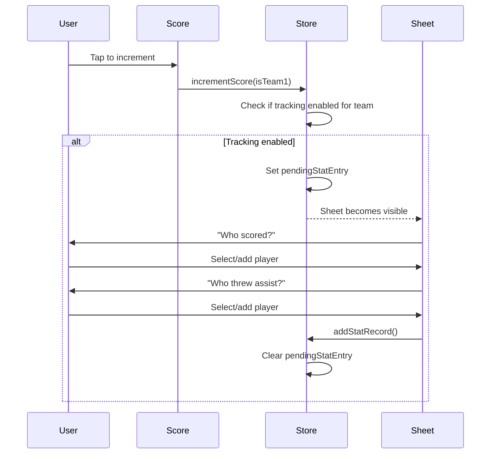

# Stat Tracking System

> Design documentation for the goal/assist tracking feature.

## Overview

The stat tracking system allows recording who scored goals and threw assists during gameplay. It's designed to be unobtrusive and built progressively—no upfront roster setup required.

## Data Model

```typescript
// In store/gameStore.ts

interface StatRecord {
  pointNumber: number; // Sequential point # for this team
  team: 'team1' | 'team2';
  goal: string | null; // Player name or null (unknown)
  assist: string | null;
}

type StatTrackingMode = 'off' | 'team1' | 'both';
```

## State

| Property           | Type                            | Description                              |
| ------------------ | ------------------------------- | ---------------------------------------- |
| `statTrackingMode` | `'off' \| 'team1' \| 'both'`    | Which teams to track stats for           |
| `team1Roster`      | `string[]`                      | Built progressively as players are added |
| `team2Roster`      | `string[]`                      | Built progressively as players are added |
| `statRecords`      | `StatRecord[]`                  | All recorded stats for the game          |
| `pendingStatEntry` | `{ team, pointNumber } \| null` | Triggers stat entry sheet                |

## Flow



## Components

### `StatEntrySheet.tsx`

- Bottom sheet modal triggered by `pendingStatEntry !== null`
- Two-step flow: Goal → Assist
- User must explicitly skip or complete entry
- Shows roster as tappable chips
- Inline "Add new player" input

### `PlayerChip.tsx`

- Reusable chip for player selection
- Selected/unselected states with accent color

## Settings

In Settings screen (`app/Settings.tsx`):

- **Stat Tracking Mode**: Segmented control with Off / My Team / Both
- **Clear Player Rosters**: Button to reset roster (appears when roster has players)

## Decrement Behavior

When score is decremented:

1. Score reduced by 1
2. Last `StatRecord` for that team is removed
3. Any `pendingStatEntry` is cleared

## Reset Behavior

On "New Game":

- `statRecords` cleared
- `pendingStatEntry` cleared
- `team1Roster` and `team2Roster` cleared
- Mode setting persists
