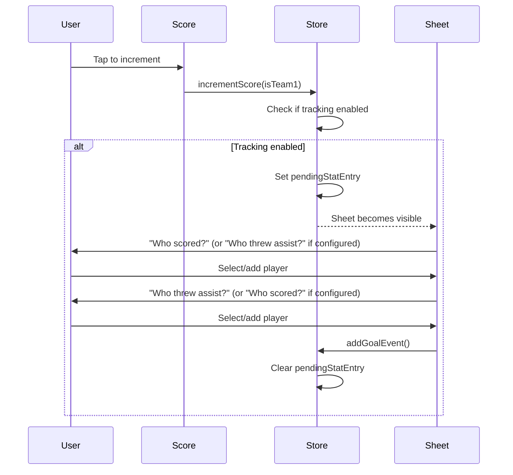

# Stat Tracking System

> Design documentation for the goal/assist tracking feature.

## Overview

The stat tracking system allows recording who scored goals and threw assists during gameplay. It's designed to be unobtrusive and built progressively—no upfront roster setup required.

## Data Model

```typescript
// In store/gameStore.types.ts

export type TurnoverType = 'block' | 'throwaway' | 'drop' | 'fiftyfifty';

// gameId is optional - populated when game is saved (for future flat DB migration)
export type GameEvent =
  | {
      type: 'goal';
      team: 'team1' | 'team2';
      goalPlayerId: string | null; // Player who scored
      assistPlayerId: string | null; // Player who assisted (or 'OTHER_TEAM' for Callahans)
      gameId?: string; // Links to SavedGame.id
    }
  | {
      type: 'turnover';
      team: 'team1' | 'team2'; // Team that committed the turnover
      subtype: TurnoverType;
      playerId: string | null;
      player2Id?: string | null; // Second player for 50/50 turnovers
      gameId?: string; // Links to SavedGame.id
    };
```

> See [Data Structure Decisions](data-structure-decisions.md) for architectural trade-offs regarding this flat structure vs. a nested point model.

## State

| Property               | Type                            | Description                                    |
| ---------------------- | ------------------------------- | ---------------------------------------------- |
| `statTrackingEnabled`  | `boolean`                       | Whether stat tracking is enabled               |
| `currentTeam`          | `SavedTeam`                     | Includes roster (built progressively)          |
| `events`               | `GameEvent[]`                   | Unified chronological log of all game events   |
| `pendingStatEntry`     | `{ team, pointNumber } \| null` | Triggers stat entry sheet                      |
| `pendingTurnoverEntry` | `{ receivingTeam } \| null`     | Triggers turnover entry sheet                  |
| `possession`           | `'team1' \| 'team2' \| null`    | Current team with the disc                     |
| `startingPossession`   | `'team1' \| 'team2' \| null`    | Team that started with the disc (for halftime) |

## Flow



## Components

### `StatEntrySheet.tsx`

- Bottom sheet modal with side-by-side layout
- Orchestrates the entry flow with side-by-side layout (info + roster)
- Uses sub-components from `components/stat-entry/`

### `components/stat-entry/StatEntryHeader.tsx`

- Displays team name and current step label
- Shows "GOAL" badge with player name during assist step

### `components/stat-entry/StatEntryRoster.tsx`

- Displays roster as a scrollable grid of `PlayerChip`s
- Compact sizing (maxHeight: 280px)

### `components/ui/PlayerChip.tsx`

- Reusable chip for player selection
- Selected/unselected states using palette colors

## Settings

In Settings screen (`app/Settings.tsx`):

- **Track My Team Stats**: Toggle switch to enable/disable stat tracking
- **Track Goal First**: Toggle switch to configure stat entry order (Goal -> Assist vs. Assist -> Goal)
- **Clear Player Rosters**: Button to reset rosters (appears when roster has players)
- **View Stats**: Access the [View Stats](view-stats.md) screen to see player breakdowns and export data
- **Reset Stats Tutorial** (Dev Only): Available at the bottom of the Dashboard in dev builds to reset the tutorial acknowledgement flag.

## Undo Behavior

When an action is undone (via `undoLastAction`):

1. The last `GameEvent` is removed from the `events` array.
2. If it was a `goal`:
   - Score for the respective team is reduced by 1.
   - Possession is returned to the scoring team.
   - `pendingStatEntry` is cleared.
   - `currentPoint` is decremented.
   - Point lines for future points are removed (`pointNumber > currentPoint`), but the current point's line is kept. See [Line Recording Logic](line-selection.md#undo-and-point-lines) for details.
3. If it was a `turnover`:
   - Possession is flipped back to the previous team.
   - `pendingTurnoverEntry` is cleared.

## Reset Behavior

On "New Game":

- `events` array cleared
- `pendingStatEntry` and `pendingTurnoverEntry` cleared
- `team1Roster` cleared
- `possession` and `startingPossession` reset to null
- `statTrackingEnabled` setting persists

## Cancel Behavior

Users can cancel out of stat entry modals without recording any data:

### StatEntrySheet (Goal/Assist Entry)

When the user taps **Cancel** (or outside the modal):

1. The score increment is reverted (undoes the point).
2. The pending goal event is removed from `events` array.
3. Possession is restored to team1.
4. Point timer is restored to its previous state.
5. `pendingStatEntry` is cleared.

This differs from selecting **Unknown**, which still records the goal with null player IDs.

### TurnoverEntrySheet (Turnover Entry)

When the user taps **Cancel** (or outside the modal):

1. `pendingTurnoverEntry` is cleared.
2. No turnover event is recorded.
3. Possession remains unchanged (no flip).

Since turnovers don't increment the score, cancel simply dismisses without side effects.
