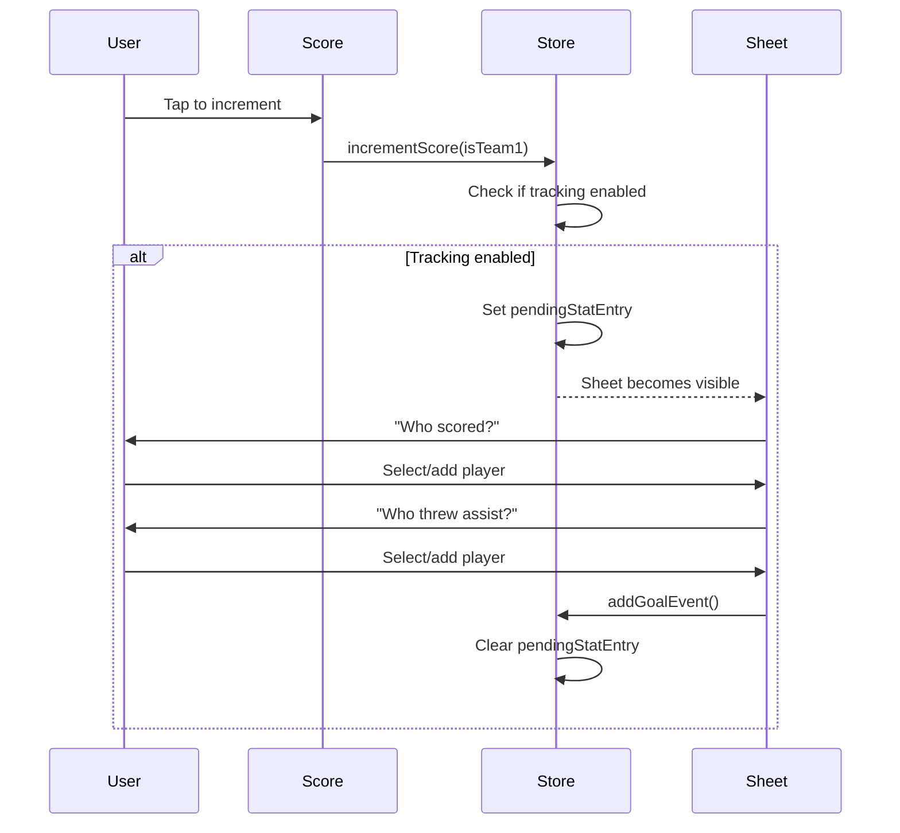

# Stat Tracking System

> Design documentation for the goal/assist tracking feature.

## Overview

The stat tracking system allows recording who scored goals and threw assists during gameplay. It's designed to be unobtrusive and built progressively—no upfront roster setup required.

## Data Model

```typescript
// In store/gameStore.types.ts

export type TurnoverType = 'block' | 'throwaway' | 'drop' | 'fiftyfifty';

// gameId is optional - populated when game is saved (for future flat DB migration)
export type GameEvent =
  | {
      type: 'goal';
      team: 'team1' | 'team2';
      goal: string | null; // Player who scored
      assist: string | null; // Player who assisted
      gameId?: string; // Links to SavedGame.id
    }
  | {
      type: 'turnover';
      team: 'team1' | 'team2'; // Team that committed the turnover
      subtype: TurnoverType;
      player: string | null;
      player2?: string | null; // Second player for 50/50 turnovers
      gameId?: string; // Links to SavedGame.id
    };
```

## State

| Property               | Type                            | Description                                    |
| ---------------------- | ------------------------------- | ---------------------------------------------- |
| `statTrackingEnabled`  | `boolean`                       | Whether stat tracking is enabled               |
| `team1Roster`          | `string[]`                      | Built progressively as players are added       |
| `events`               | `GameEvent[]`                   | Unified chronological log of all game events   |
| `pendingStatEntry`     | `{ team, pointNumber } \| null` | Triggers stat entry sheet                      |
| `pendingTurnoverEntry` | `{ receivingTeam } \| null`     | Triggers turnover entry sheet                  |
| `possession`           | `'team1' \| 'team2' \| null`    | Current team with the disc                     |
| `startingPossession`   | `'team1' \| 'team2' \| null`    | Team that started with the disc (for halftime) |

## Flow



## Components

### `StatEntrySheet.tsx`

- Bottom sheet modal optimized for permanent landscape orientation
- Orchestrates the entry flow with side-by-side layout (info + roster)
- Uses sub-components from `components/stat-entry/`

### `components/stat-entry/StatEntryHeader.tsx`

- Displays team name and current step label
- Shows "GOAL" badge with player name during assist step

### `components/stat-entry/StatEntryRoster.tsx`

- Displays roster as a scrollable grid of `PlayerChip`s
- Compact sizing for landscape (maxHeight: 280px)

### `components/ui/PlayerChip.tsx`

- Reusable chip for player selection
- Selected/unselected states using palette colors

## Settings

In Settings screen (`app/Settings.tsx`):

- **Track My Team Stats**: Toggle switch to enable/disable stat tracking
- **Clear Player Rosters**: Button to reset rosters (appears when roster has players)
- **View Stats**: Access the [View Stats](view-stats.md) screen to see player breakdowns and export data

## Undo Behavior

When an action is undone (via `undoLastAction`):

1. The last `GameEvent` is removed from the `events` array.
2. If it was a `goal`:
   - Score for the respective team is reduced by 1.
   - Possession is returned to the scoring team.
   - `pendingStatEntry` is cleared.
   - `currentPoint` is decremented.
3. If it was a `turnover`:
   - Possession is flipped back to the previous team.
   - `pendingTurnoverEntry` is cleared.

## Reset Behavior

On "New Game":

- `events` array cleared
- `pendingStatEntry` and `pendingTurnoverEntry` cleared
- `team1Roster` cleared
- `possession` and `startingPossession` reset to null
- `statTrackingEnabled` setting persists
