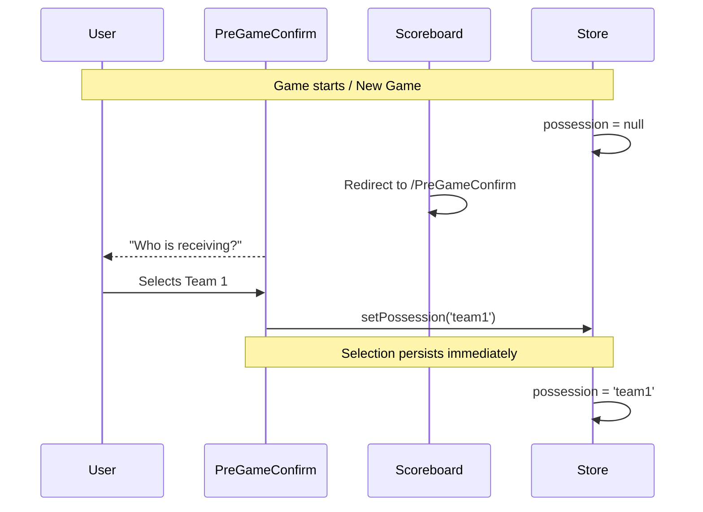
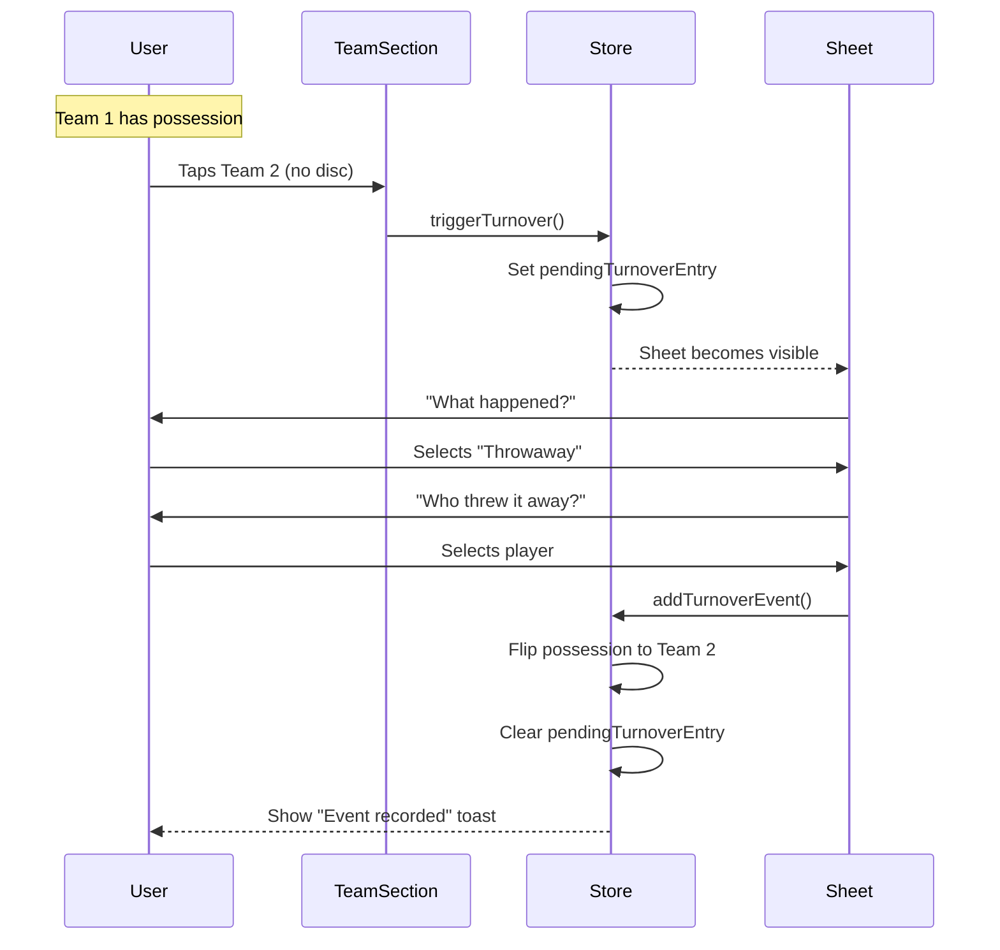
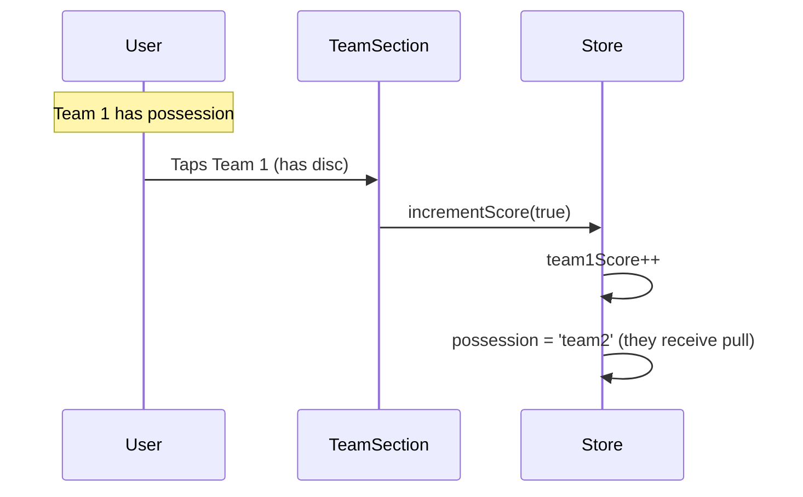
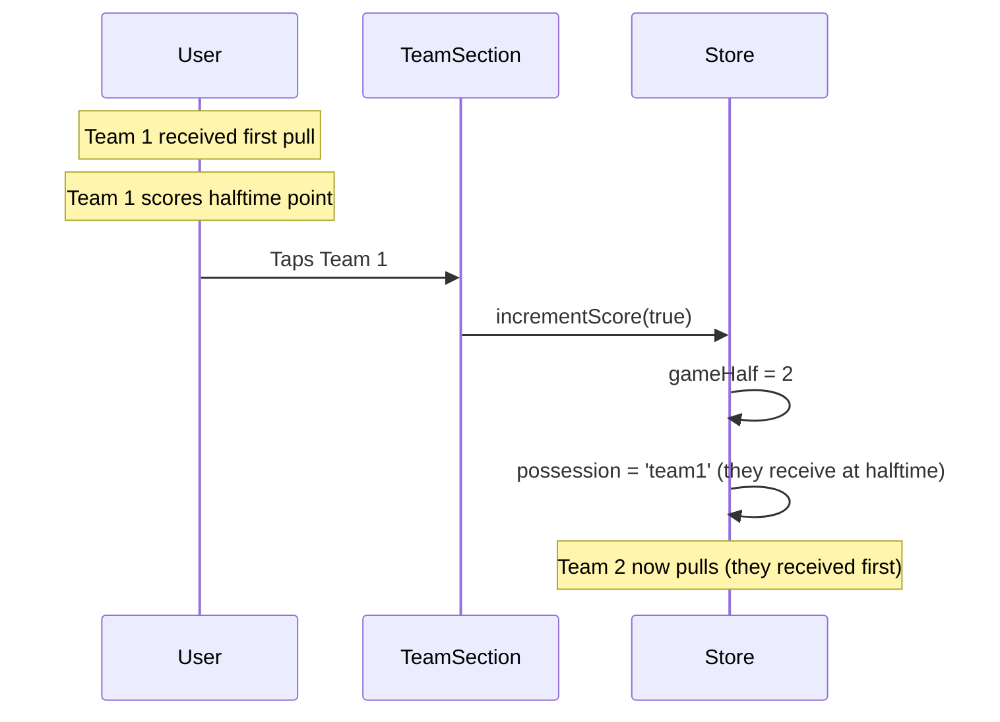

# Turnover Tracking System

> Design documentation for the turnover event tracking feature (blocks, throwaways, drops).

## Overview

The turnover tracking system records turnovers (blocks, throwaways, drops) during gameplay using a possession-aware approach. When a user taps the team that doesn't have the disc, a turnover is recorded and possession flips.

This feature integrates with the existing stat tracking setting—turnover tracking is enabled when stat tracking is on.

## Plus/Minus System

| Event     | Value | Attribution               |
| --------- | ----- | ------------------------- |
| Goal      | +1    | Scoring player            |
| Assist    | +1    | Assisting player          |
| Block     | +1    | Player who made the block |
| Throwaway | -1    | Player who threw it away  |
| Drop      | -1    | Player who dropped it     |

## Data Model

```typescript
// In store/gameStore.types.ts

export type TurnoverType = 'block' | 'throwaway' | 'drop' | 'fiftyfifty';

// gameId is optional - populated when game is saved (for future flat DB migration)
export type GameEvent =
  | {
      type: 'goal';
      team: 'team1' | 'team2';
      goal: string | null;
      assist: string | null;
      gameId?: string; // Links to SavedGame.id
    }
  | {
      type: 'turnover';
      team: 'team1' | 'team2';
      subtype: TurnoverType;
      player: string | null;
      player2?: string | null;
      gameId?: string; // Links to SavedGame.id
    };
```

## State

| Property               | Type                         | Description                         |
| ---------------------- | ---------------------------- | ----------------------------------- |
| `possession`           | `'team1' \| 'team2' \| null` | Which team currently has the disc   |
| `events`               | `GameEvent[]`                | Unified chronological log of events |
| `pendingTurnoverEntry` | `{ receivingTeam } \| null`  | Triggers turnover entry sheet       |

## Flow

### Initial Possession (Pre-Game Confirm)



### Turnover Recording



### Post-Record Confirmation (Toast)

After a turnover is recorded, the scoreboard shows a short confirmation toast near the top:

- Team-based examples:
  - `Rivals blocked us`
  - `Rivals turnover`
- Player-based examples:
  - `Alex got a block`
  - `Casey threw it away`
  - `Turnover by Alex and Casey`

The toast is informational only (no inline **Undo** action).

Color coding:

- **Green** for positive outcomes: block by team1, or throwaway by team2.
- **Red** for all other turnover outcomes.

### Score After Goal



### Halftime Possession

At halftime, the team that received the first pull of the game now pulls (the other team receives):



## Tap Behavior

The tap behavior depends on the stat tracking mode setting:

| Stat Tracking Mode | Tap Team WITH Disc | Tap Team WITHOUT Disc |
| ------------------ | ------------------ | --------------------- |
| **Off**            | Increment score    | Increment score       |
| **My Team / Both** | Increment score    | Trigger turnover flow |

## Components

### `PreGameConfirm.tsx`

Full-screen setup that appears when required start-of-game values are missing:

- Receiving team is required when stat tracking is enabled and `possession === null`
- Starting ratio is required when gender ratio tracking is enabled and `firstPointRatio === null`

Selections are written directly to store when tapped, so they are preserved if the user navigates away and returns.

### `TurnoverEntrySheet.tsx`

Bottom sheet modal that appears when `pendingTurnoverEntry` is set.

**Two-step flow:**

1. **Select event type**: Block, Throwaway, or Drop
2. **Select player** (optional): Choose from roster who caused the event

**Attribution logic:**

- **Block**: Attributed to the _receiving_ team (+1 for blocker)
- **Throwaway/Drop**: Attributed to the team that _had possession_ (-1 for player)

### `TeamScoreSection.tsx` (Modified)

**New Props:**

- `hasPossession?: boolean` — Whether this team has the disc
- `onTurnover?: () => void` — Called when user taps to trigger turnover

**Visual:**

- Small circular indicator (●) appears next to timeouts when team has possession
- Animates in/out with fade transition

**Tap behavior:**

- If `hasPossession === undefined`: Original behavior (increment score)
- If `hasPossession === true`: Increment score (goal)
- If `hasPossession === false`: Call `onTurnover()` (turnover)

## Settings Integration

The existing stat tracking setting controls turnover tracking:

- **Off**: No possession tracking, original tap behavior
- **On**: Possession tracking enabled, tracks my team stats

No additional settings required.

## Reset Behavior

On "New Game":

- `events` array cleared
- `pendingTurnoverEntry` cleared
- `possession` reset to `null` (triggers pull prompt)
