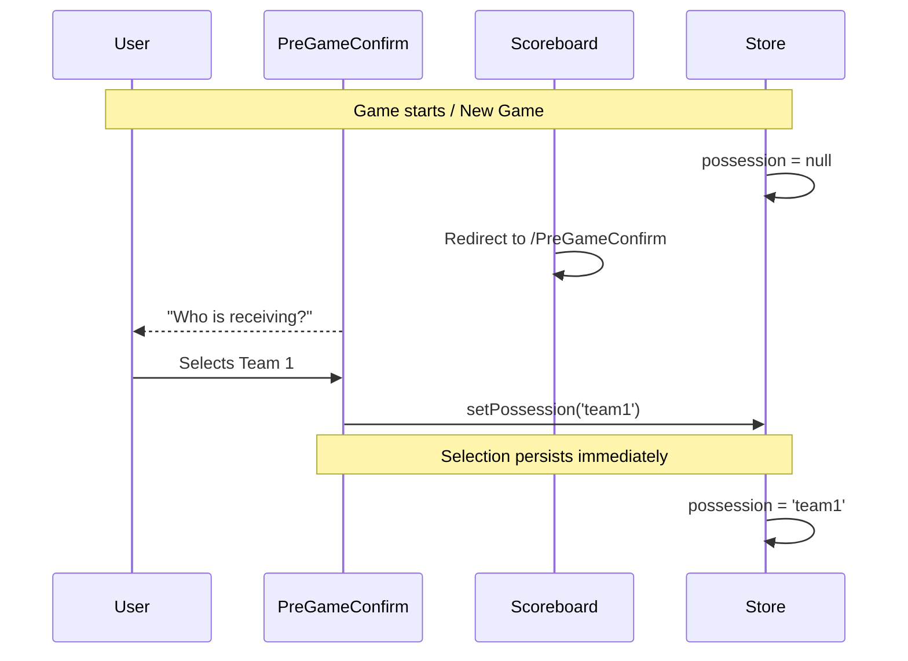
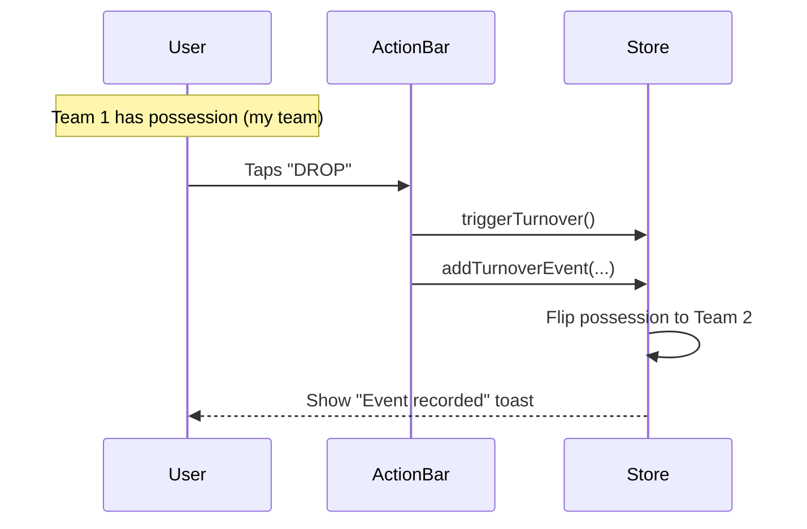
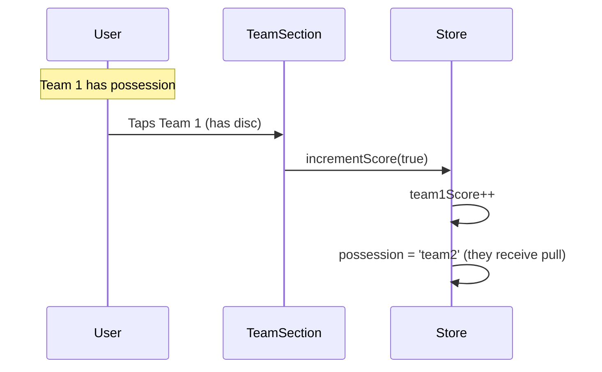
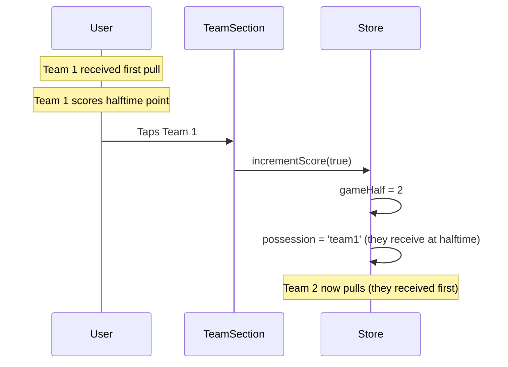

# Turnover Tracking System

> Maintained behavior reference for basic-game turnover tracking (blocks, throwaways, drops, and
> 50/50 attribution).

## Overview

The turnover tracking system records turnovers (blocks, throwaways, drops, 50/50) during gameplay using a possession-aware approach.
Turnovers are recorded from the floating `ScoreboardActionBar` action buttons

For `50/50` turnovers by the tracked team, the event stores both thrower and receiver attribution.
It records the judgment that both players were partially at fault; if one player caused both halves
of the mistake, that player can be recorded in both roles.

This feature integrates with the existing stat tracking setting—turnover tracking is enabled when stat tracking is on.

## Plus/Minus System

| Event     | Value | Attribution               |
| --------- | ----- | ------------------------- |
| Goal      | +1    | Scoring player            |
| Assist    | +1    | Assisting player          |
| Block     | +1    | Player who made the block |
| Throwaway | -1    | Player who threw it away  |
| Drop      | -1    | Player who dropped it     |

## Data Model

```typescript
// In store/basic/gameStore.types.ts

export type TurnoverType = 'block' | 'throwaway' | 'drop' | 'fiftyfifty';

// gameId is optional - populated when game is saved (for future flat DB migration)
export type GameEvent =
  | {
      type: 'goal';
      team: 'team1' | 'team2';
      goalPlayerId: string | null;
      assistPlayerId: string | null;
      gameId?: string; // Links to SavedGame.id
    }
  | {
      type: 'turnover';
      team: 'team1' | 'team2';
      subtype: TurnoverType;
      playerId: string | null;
      player2Id?: string | null;
      gameId?: string; // Links to SavedGame.id
    };
```

## State

| Property               | Type                         | Description                         |
| ---------------------- | ---------------------------- | ----------------------------------- |
| `possession`           | `'team1' \| 'team2' \| null` | Which team currently has the disc   |
| `events`               | `GameEvent[]`                | Unified chronological log of events |
| `pendingTurnoverEntry` | `{ receivingTeam } \| null`  | Triggers turnover entry sheet       |

For a `TurnoverEvent`, `team` is the Basic turnover attribution team. A block credits the
defending team; a drop, throwaway, or 50/50 credits the team that lost possession.

## Flow

### Initial Possession (Pre-Game Confirm)



### Turnover Recording



### Post-Record Confirmation (Toast)

After a turnover is recorded, the scoreboard shows a short confirmation toast near the top:

- Team-based examples:
  - `Rivals blocked us`
  - `Rivals turnover`
- Player-based examples:
  - `Alex got a block`
  - `Casey threw it away`
  - `Turnover by Alex and Casey`

The toast is informational only (no inline **Undo** action).

Color coding:

- **Green** for positive outcomes: block by team1, or throwaway by team2.
- **Red** for all other turnover outcomes.

### Score After Goal



### Halftime Possession

At halftime, the team that received the first pull of the game now pulls (the other team receives):



## Tap Behavior

Team-section taps and turnover controls depend on possession + stat tracking mode:

| Stat Tracking Mode | Tap Team WITH Disc | Tap Team WITHOUT Disc | Turnover Recording            |
| ------------------ | ------------------ | --------------------- | ----------------------------- |
| **Off**            | Increment score    | Increment score       | Disabled                      |
| **My Team / Both** | Increment score    | No score action       | `ScoreboardActionBar` buttons |

## Components

### `PreGameConfirm.tsx`

Full-screen setup that appears when required start-of-game values are missing:

- Receiving team is required when stat tracking is enabled and `possession === null`
- Starting ratio is required when gender ratio tracking is enabled and `firstPointRatio === null`

Selections are written directly to store when tapped, so they are preserved if the user navigates away and returns.

### `ScoreboardActionBar.tsx`

Floating action bar shown while stat tracking is enabled (or during active timeout).

Turnover actions:

- When `possession === 'team1'` (my team has disc): record opponent-pressure outcomes (`oppBlock`) and my-team turnovers (`drop`, `throwaway`, `fiftyfifty`).
- When `possession === 'team2'` (opponent has disc): record `block` and `turn`.

In `components/basic/scoreboard/LiveScoreboard.tsx`, `onAction` first calls `triggerTurnover()`, then records the selected event via `addTurnoverEvent(...)` or shows the inline turnover-entry sheet for player-attributed types.

### `TeamScoreSection.tsx` (Modified)

**Relevant Props:**

- `hasPossession?: boolean` — Whether this team has the disc

**Visual:**

- Small circular indicator (●) appears next to timeouts when team has possession
- Animates in/out with fade transition

**Tap behavior:**

- If `hasPossession === undefined`: Original behavior (increment score)
- If `hasPossession === true`: Increment score (goal)

## Settings Integration

The existing stat tracking setting controls turnover tracking:

- **Off**: No possession tracking, original tap behavior
- **On**: Possession tracking enabled, tracks my team stats

No additional settings required.

## Reset Behavior

On "New Game":

- `events` array cleared
- `pendingTurnoverEntry` cleared
- `possession` reset to `null` (triggers pull prompt)
